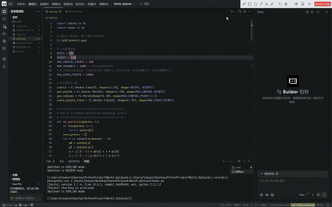

# 曲线渲染进阶实验：反走样光栅化与 B 样条曲线（202411081090 陈奕翔 计算机科学与技术）

## 实验目标

通过本次进阶选做实验，你将能够：

- 深刻理解图形学中**走样（Aliasing）**与**反走样（Anti-aliasing）**的本质，掌握基于距离衰减模型的亚像素级平滑渲染技术。
- 认识贝塞尔曲线在**全局控制**和**高阶计算**上的局限性。
- 掌握 **均匀三次 B 样条曲线（B-Spline）** 的数学定义、基矩阵推导及其“局部控制”的优秀几何特性。
- 熟练运用矩阵运算替代复杂的递归算法，提升 CPU 端的几何采样效率。

## 实验背景与数学原理

### 1. 亚像素级反走样 (Anti-aliasing)
在基础的光栅化绘制中，直接将浮点坐标截断为整数（强制类型转换）仅能点亮单一物理像素，这会导致曲线边缘呈现出锯齿状的阶梯感。
本实验引入了基于局部像素邻域的平滑策略：
- **距离计算**：获取精确几何浮点坐标 $(xf, yf)$，并考察其周围 $3 \times 3$ 的物理像素网格。计算像素中心 $(px, py)$ 与精确坐标的空间欧氏距离：$dist = \sqrt{(px - xf)^2 + (py - yf)^2}$。
- **权重混合**：基于距离衰减模型分配颜色权重。距离几何点越近，光强贡献越大（`weight = max(0, 1 - dist)`）。通过颜色的透明度/亮度混合，在视觉上欺骗人眼，实现平滑过渡。
- **防过曝机制**：为了避免同一像素被密集的采样点重复叠加导致亮度溢出，使用最大值混合（Max Blending）替代传统的加法混合。

### 2. 均匀三次 B 样条曲线 (Uniform Cubic B-Spline)
贝塞尔曲线“牵一发而动全身”，且控制点越多阶数越高。B 样条曲线通过引入节点向量和分段多项式基函数解决了这一问题：
- **局部控制**：修改一个控制点只影响曲线的一小段，整体形态保持稳定。
- **矩阵分段求解**：每 4 个相邻控制点构成一段三次曲线。通过标准基矩阵 $M_{bspline}$，可以避免复杂的 Cox-de Boor 递归，直接通过矩阵乘法 $T \times M_{bspline} \times P$ 高效求解局部采样坐标。

## 参考效果

程序成功运行后，会弹出一个 800x800 的 GUI 窗口。你可以通过键盘按键在“绿色贝塞尔曲线”与“蓝色 B 样条曲线”之间无缝切换，直观对比反走样带来的丝滑边缘，以及 B 样条卓越的局部形态控制能力。



## 环境要求

- Python 3.12+
- Taichi 1.7.4+ (GPU 后端)
- NumPy
- 项目包管理器：`uv`

## 运行项目

推荐使用 `uv` 包管理器直接运行，它可以自动识别 `.venv` 虚拟环境，避免找不到 `taichi` 模块的环境路径问题：

```bash
# 在 Work3_Optional 根目录下执行
uv run main.py
